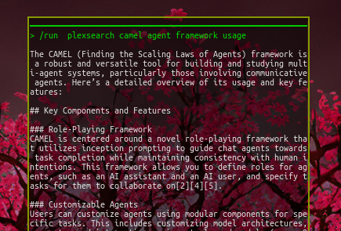

<div align="center">

# 🔍 Perplexity Search

[](https://www.python.org/downloads/)
[](https://opensource.org/licenses/MIT)
[](https://github.com/tom-doerr/perplexity_search/pulls)
[](https://github.com/tom-doerr/perplexity_search/issues)
[](https://github.com/tom-doerr/perplexity_search/stargazers)

A powerful Python tool for performing technical searches using the Perplexity API, optimized for retrieving precise facts, code examples, and numerical data.



</div>

<div align="center">

## 📋 Table of Contents

[Overview](#overview) •
[Features](#features) •
[Installation](#installation) •
[Usage](#usage) •
[Configuration](#configuration) •
[Requirements](#requirements) •
[Error Handling](#error-handling) •
[Contributing](#contributing) •
[FAQ](#faq) •
[License](#license)

</div>

## 🌟 Overview

Perplexity Search is a command-line tool and Python library that leverages the power of Perplexity AI to provide accurate, technical search results. It's designed for developers, researchers, and technical users who need quick access to precise information, code examples, and technical documentation.

## ✨ Features

- **Perform searches using different LLaMA models (small, large, huge)**
- **Configurable API key support via environment variable or direct input**
- **Customizable search queries with temperature and other parameters**
- **Command-line interface for easy usage**
- **Focused on retrieving technical information with code examples**
- **Returns responses formatted in markdown**
- **Optimized for factual and numerical data**

## Installation

```bash
pip install plexsearch
```

## Usage

### As a Python Module

```python
from perplexity_search import perform_search

# Using environment variable for API key
result = perform_search("What is Python's time complexity for list operations?")

# Or passing API key directly
result = perform_search("What are the differences between Python 3.11 and 3.12?", api_key="your-api-key")

# Specify a different model
result = perform_search("Show me example code for Python async/await", model="llama-3.1-sonar-huge-128k-online")
```

### Command Line Interface

```bash
# Basic search
plexsearch "What is Python's time complexity for list operations?"

# Specify model
plexsearch --model llama-3.1-sonar-huge-128k-online "What are the differences between Python 3.11 and 3.12?"

# Use specific API key
plexsearch --api-key your-api-key "Show me example code for Python async/await"

# Multi-word queries work naturally
plexsearch tell me about frogs

# Disable streaming output
plexsearch --no-stream "tell me about frogs"

Note: Streaming is automatically disabled when running inside Aider to prevent
filling up the context window.
```

## Configuration

### API Key

Set your Perplexity API key in one of these ways:
1. **Environment variable:**
   ```bash
   export PERPLEXITY_API_KEY=your-api-key
   # Or add to your ~/.bashrc or ~/.zshrc for persistence
   echo 'export PERPLEXITY_API_KEY=your-api-key' >> ~/.bashrc
   ```
2. **Pass directly in code or CLI:** `--api-key your-api-key`

### Available Models

The following models can be specified using the `--model` parameter:

- `llama-3.1-sonar-small-128k-online` (Faster, lighter model)
- `llama-3.1-sonar-large-128k-online` (Default, balanced model)
- `llama-3.1-sonar-huge-128k-online` (Most capable model)

## Requirements

- **Python 3.x**
- **requests library**
- **Perplexity API key** (obtain from [Perplexity API](https://docs.perplexity.ai/))

## Error Handling

The tool includes error handling for:
- **Missing API keys**
- **Invalid API responses**
- **Network issues**
- **Invalid model selections**

## Contributing

We welcome contributions! Please see our [CONTRIBUTING.md](CONTRIBUTING.md) for more details on how to contribute to this project. Check our [CHANGELOG.md](CHANGELOG.md) for recent updates and changes.

## FAQ

**Q:** How do I get an API key for Perplexity?

**A:** You can obtain an API key by signing up on the [Perplexity API](https://docs.perplexity.ai/) website.

**Q:** What models are available for search?

**A:** The available models are `small`, `large`, and `huge`.

## License

MIT License - see the [LICENSE](LICENSE) file for details
